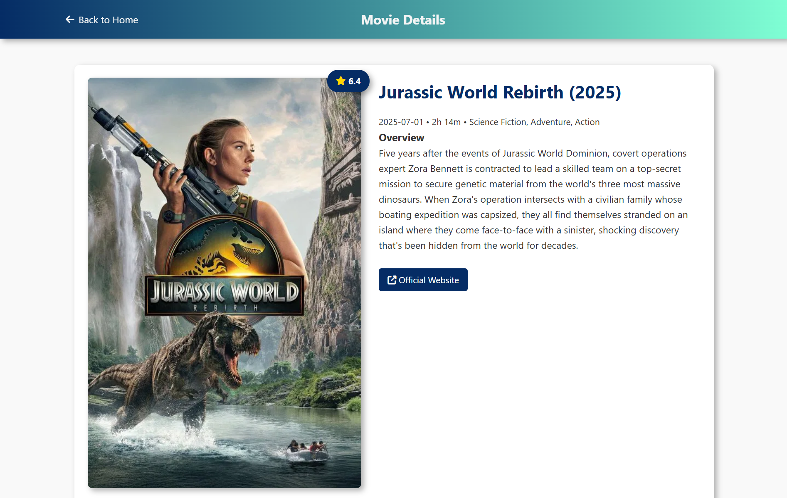
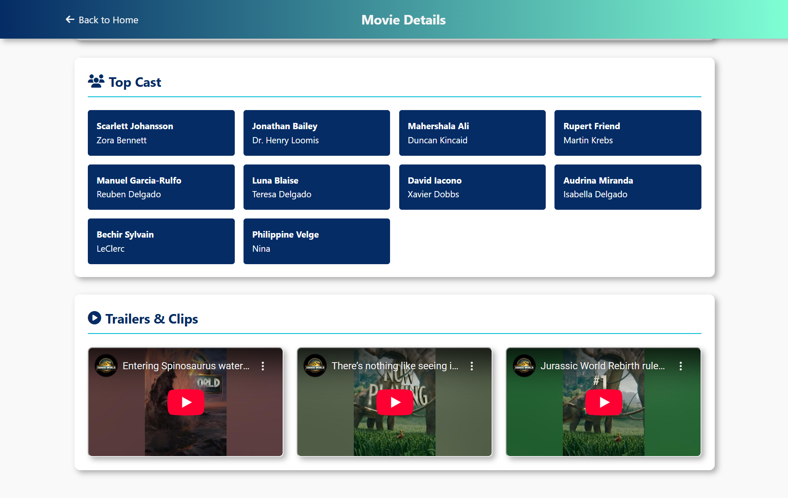

# 🎬 Movie Mingle

A sleek, responsive movie search app built using **Vanilla JS**, **Express.js**, and powered by the [TMDB API](https://www.themoviedb.org/documentation/api). Search movies, explore trending titles, view cast, trailers, and dive into movie details — all in one place.

> 🔴 **Live Demo**: [movie-mingle-app.vercel.app](https://movie-mingle-app.vercel.app)


---

## 🚀 Features

- 🔍 **Search** any movie by name
- 📈 **Trending Movies** of the week
- 🧑‍🤝‍🧑 View **Top Cast**
- 🎞️ Watch **trailers and clips**
- 🌐 **Responsive UI** for desktop & mobile
- ⚡ Powered by **TMDB API**
- ☁️ **Deployed** on:
  - **Frontend** → Vercel
  - **Backend** → Render

---

## 🛠️ Tech Stack

| Client         | Server           | API       |
|----------------|------------------|-----------|
| HTML, CSS, JS  | Node.js, Express | TMDB API  |

---

## 📂 Project Structure

```
movie-search-app/
│
├── client/                 # Frontend
│   ├── index.html
│   ├── index2.html
│   ├── app.js
│   ├── app2.js
│   └── style.css
│
├── server/                 # Backend (Express)
│   ├── index.js
│   └── .env
│
├── README.md
└── package.json
```

---

## 🔧 Setup Instructions

### 1. Clone the Repository

```bash
git clone https://github.com/AshishSinsinwal/MovieMingleWeb.git
cd movie-search-app
```

### 2. Setup Backend

```bash
cd server
npm install
```

Create a `.env` file in the server directory:

```env
API_KEY=your_tmdb_api_key
PORT=5000
```

Start the server:

```bash
npm start
```

### 3. Setup Frontend

Navigate to the client directory and open `index.html` in your browser using Live Server or any local server.

Alternatively, you can open `client/index.html` directly in your browser.

---

## 🌍 Deployment

### Frontend (Vercel)
- Deployed from `/client` folder 
- **Live URL**: [movie-mingle-app.vercel.app](https://movie-mingle-app.vercel.app)

### Backend (Render)
- Deployed from `/server` folder
- **API URL**: [movie-mingle-app.onrender.com](https://movie-mingle-app.onrender.com)

---

## 🔁 Dynamic BASE_URL Switching

The app automatically detects the environment and switches between local and production URLs:

```javascript
const BASE_URL = window.location.hostname.includes("localhost")
  ? "http://localhost:5000"
  : "https://movie-mingle-app.onrender.com";
```

---

## 🎯 API Endpoints

The backend provides the following endpoints:

- `GET /api/search?query={movie_name}` - Search movies
- `GET /api/trending` - Get trending movies
- `GET /api/movie/{id}` - Get movie details
- `GET /api/movie/{id}/cast` - Get movie cast
- `GET /api/movie/{id}/videos` - Get movie trailers

---

## 🔑 Environment Variables

Create a `.env` file in the server directory with:

```env
API_KEY=your_tmdb_api_key_here
PORT=5000
```

**Note**: Get your API key from [TMDB](https://www.themoviedb.org/settings/api)

---

## 💡 Future Improvements

- ⭐ Add movie watchlist/favorites
- 🌗 Dark mode toggle
- 🔁 Infinite scroll or pagination
- 🎨 Add loading skeletons and animations (AOS)
- 🔍 Advanced search filters (genre, year, rating)
- 📱 Progressive Web App (PWA) support
- 🎭 Similar movies recommendations

---

## 🙌 Credits

- **TMDB** for their amazing API
- **Icons** from Font Awesome
- **Designed & Built** by [Ashish Sinsinwal](https://github.com/AshishSinsinwal)

---

## 📸 Screenshots

| Search Page | Movie Detail |
|-------------|--------------|
|  |  |

---

## 🐛 Known Issues

- Images may load slowly on first visit
- API rate limiting may occur with excessive requests

---

## 🤝 Contributing

Contributions are welcome! Please feel free to submit a Pull Request.

1. Fork the project
2. Create your feature branch (`git checkout -b feature/AmazingFeature`)
3. Commit your changes (`git commit -m 'Add some AmazingFeature'`)
4. Push to the branch (`git push origin feature/AmazingFeature`)
5. Open a Pull Request

---

## 📄 License

This project is licensed under the MIT License - see the [LICENSE](LICENSE) file for details.

**MIT License** - Free to use, remix, or improve — credits appreciated!

---

## 📞 Contact

**Ashish Sinsinwal** - [@AshishSinsinwal](https://github.com/AshishSinsinwal)

Project Link: [https://github.com/AshishSinsinwal/MovieMingleWeb.git](https://github.com/AshishSinsinwal/MovieMingleWeb.git)

---

⭐ **Star this repo** if you found it helpful!